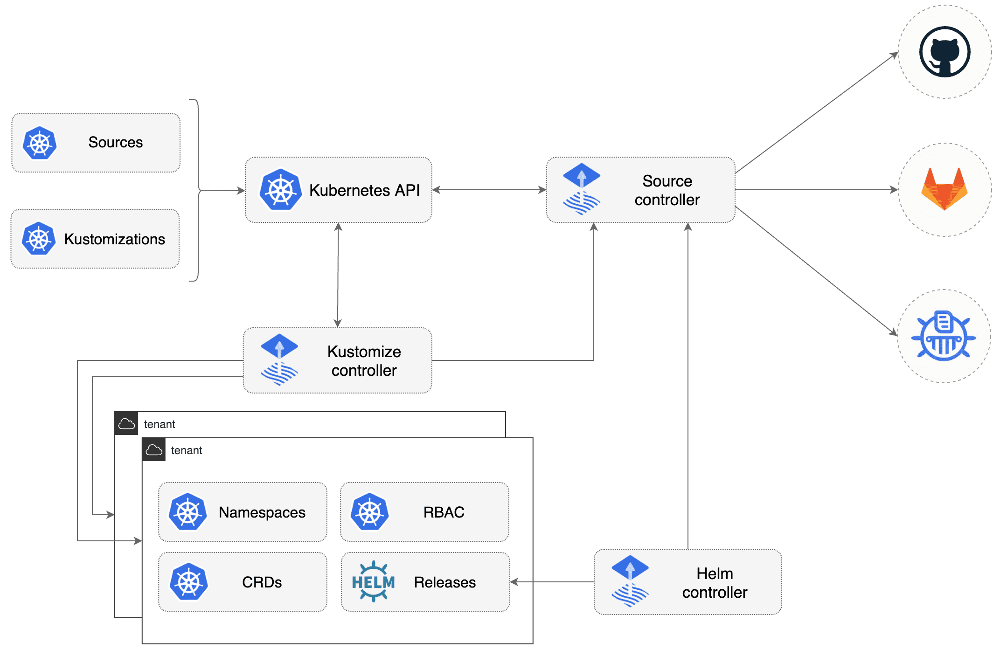

## Install Flux with Flux CLI

Install the flux cli:
```console
$ curl -s https://fluxcd.io/install.sh | sudo bash
```

#### Bootstrap with Flux CLI

The flux bootstrap command deploys the Flux controllers on Kubernetes cluster(s) and configures the controllers to sync the cluster(s) state from a Git repository. Besides installing the controllers, the bootstrap command pushes the Flux manifests to the Git repository and configures Flux to update itself from Git.



Before bootsraping the cluster, run the following commands in the path you are going to put your flux resources:
If you are installing flux on Kubernetes instead of OKD, you can skip the `OKD` section and go directly to the `bootstrap` section to install flux.  

#### OKD 
If you are installing flux on OKD, before bootsraping the cluster, run the following commands in the path you are going to put your flux resources:
```console
$ mkdir -p flux-system
touch flux-system/gotk-components.yaml \
    flux-system/gotk-sync.yaml \
    flux-system/kustomization.yaml
```
Put the following in the `kustomization.yaml` file:
```console
apiVersion: kustomize.config.k8s.io/v1beta1
kind: Kustomization
resources: # manifests generated during bootstrap
  - gotk-components.yaml
  - gotk-sync.yaml
patches:
  # target all controllers
  - patch: | 
      # strategic merge or JSON patch
    target:
      kind: Deployment
      labelSelector: "app.kubernetes.io/part-of=flux"
  # target controllers by name
  - patch: |
      # strategic merge or JSON patch      
    target:
      kind: Deployment
      name: "(kustomize-controller|helm-controller)"
  # add a command argument to a single controller
  - patch: |
      - op: add
        path: /spec/template/spec/containers/0/args/-
        value: --concurrent=5      
    target:
      kind: Deployment
      name: "source-controller"
```
With cluster admin rights for the target OpenShift cluster run the following script:
```console
#!/usr/bin/env bash
set -e

FLUX_NAMESPACE="flux-system"
FLUX_CONTROLLERS=(
"source-controller"
"kustomize-controller"
"helm-controller"
"notification-controller"
"image-reflector-controller"
"image-automation-controller"
)

for i in ${!FLUX_CONTROLLERS[@]}; do
  oc adm policy add-scc-to-user nonroot system:serviceaccount:${FLUX_NAMESPACE}:${FLUX_CONTROLLERS[$i]}
done
````
Now bootstrap flux:
```console
$ flux bootstrap git \
  --token-auth=true \
  --url=https://dev.azure.com/<org>/<project>/_git/<repository> \
  --branch=<branchname> \
  --path=<flux-resources-path>
  --password=<azure-PAT> \
  --author-email=<azure-email> \
  --author-name=<user> \
```

After bootstraping flux, the resources under the `--path` which are usually a pair of `HelmReository` and `HelmRelease` will be deployed in the cluster. `HelmReository` tells flux where to look for the chart that has to be deployed and `HelmRelease` defines the chart. for further information, you can look under the fluxcd directory to see example of how these files are created or look through the `References` part of this manual. 

### References
After bootstraping flux, the resources under the `--path` which are usually a pair of `HelmReository` and `HelmRelease` will be deployed in the cluster. `HelmReository` tells flux where to look for the chart that has to be deployed and `HelmRelease` defines the chart. for further information, you can look under the `fluxcd/examples` directory to see example of how these files are created or look through the `References` part of this manual. 

## Install Flux with Terraform
Go to the terraform directory and run the following commands:
```console
cd terraform
terraform init
terraform plan -out main.tfplan
terraform apply main.tfplan
```

## References
* https://fluxcd.io/flux/installation/#install-the-flux-cli
* https://fluxcd.io/flux/components/
* https://fluxcd.io/flux/components/source/helmrepositories/
* https://fluxcd.io/flux/components/helm/helmreleases/
* https://fluxcd.io/flux/installation/configuration/openshift/